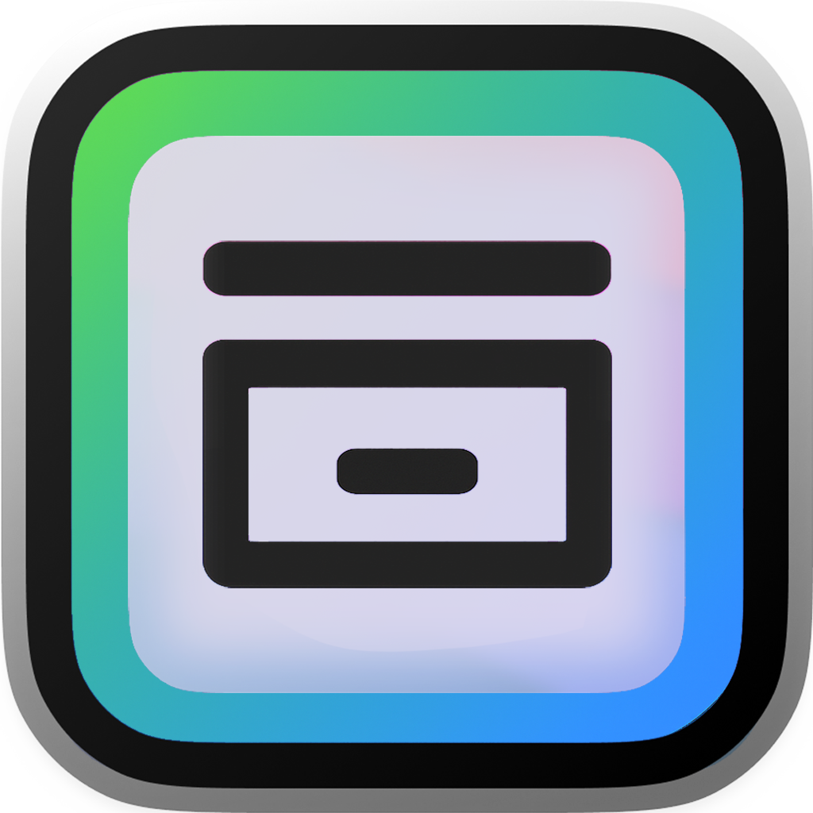
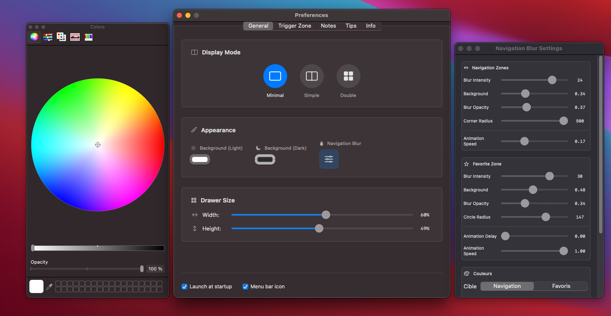
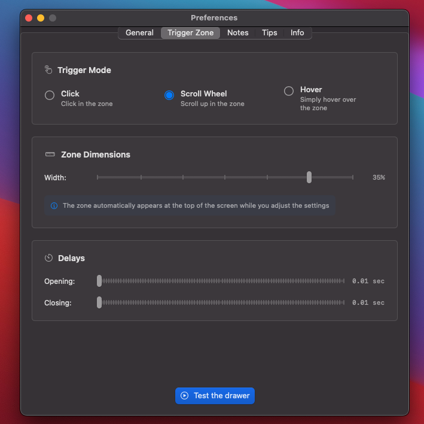
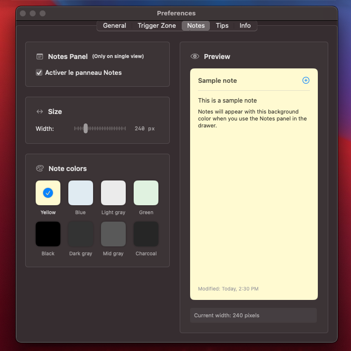
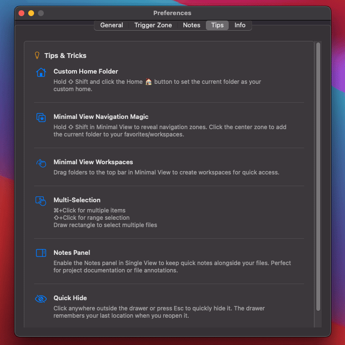
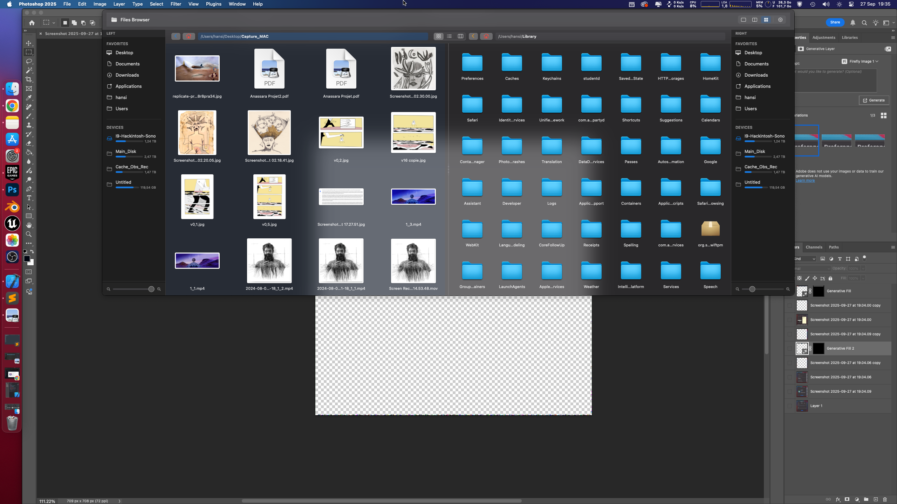
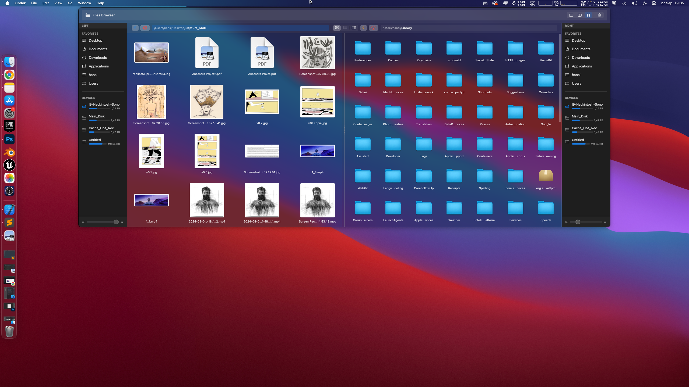
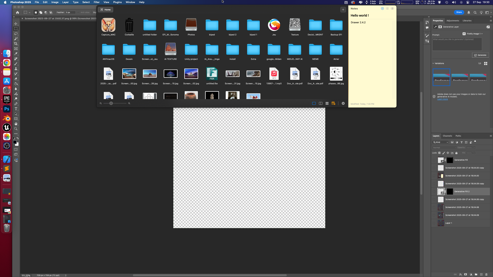
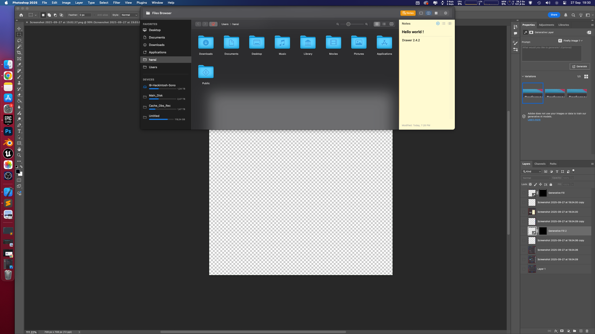

# Drawer



<div>
<h3>Drawer</h3>

  
<p>DrawerApp is a navigation drawer that appears at the top of the macOS screen, allowing you to quickly access your files without taking your eyes off the current application.
It makes adding files to your work software easier with minimal, single, or dual-panel modes—particularly useful for workflows that require frequent access to resources. 
It also provides quick access to a dedicated notes panel, independent from the one built into macOS.</p>
  
</div>
<div align="center">
<a href="https://github.com/Ratactac/Drawer/releases"></a>
</div>
<br/><br/>
<div align="center">
<a href="https://github.com/Ratactac/Drawer/releases"></a>
<a href="https://github.com/Ratactac/Drawer/blob/main/License.txt"></a>
<a href="https://github.com/Ratactac/Drawer"></a>
</div>
<br/>
<br/>

<br/>

</div>

<hr>

> [!WARNING]  
> Drawer v2.4.2 is a beta. It was developed primarily for my personal use, and is not necessarily intended to evolve into a fully maintained product. This version was adapted to my macOS Sonoma (Intel) setup.  

## Download

Go to [Releases](https://github.com/Ratactac/Drawer/releases) and download the latest `.dmg`.

## Key features of Drawer

- Open your files directly from a drawer at the top of the screen without leaving your current application.

- Choose between a **minimal**, **single** or **double** panel for quick access to your files. Add favourites and organise your access as you wish.

- Quickly access a dedicated notes panel, independent of the Notes application built into macOS.

- Easily add your files to your work software using drag and drop.

- Designed for workflows that require frequent access to resources.

- Adjust the layout and behaviour of the drawer to suit your personal workflow.

- Developed and optimised for a macOS Sonoma configuration running on Intel.

- Initially created for the developer's personal use, with no guarantee of future development.

- Mix of Swift and Appkit for performance.


## Screenshots (Settings)

<div align="center">




</div>

## How to install and use the app

1. [Download the app](https://github.com/Drawer/Drawer/releases)
2. Copy the Drawer app file from the .dmg file to your Applications folder
3. Click on the `Drawer` app
4. Add the app to `Launch` 
5. Open `Settings…` for customization options and even more options).

### macOS compatibility

| Drawer version         | macOS version     | Silicon               |
| ---------------------- | ----------------- | --------------------- |
| v2.4.4                 | Sonomoa 14.7      | Intel / Apple Silicon | 


### Add Notes
- I was only able to test it on my Intel x86 Sonoma. But the build is also Apple Silicon, so I don't know if it will work. 
- The interface is designed and based on the dark appearance. There may be some defaults in light mode.
- Next update will add drag & drop between double view. 

## How to build

Clone the project via this Terminal command: 
```sh
git clone https://github.com/Drawer/Drawer.git

- You're all set! Now open the `MonitorControl.xcodeproj` with Xcode! 
```

## ScreenShot 

<br/>
<br/>

<br/>

</div>

<hr>

<br/>
<br/>

<br/>

</div>

<hr>

<br/>
<br/>

<br/>

</div>

<hr>

<br/>
<br/>

<br/>

</div>

<hr>

<br/>
<br/>

<br/>

</div>

<hr>
