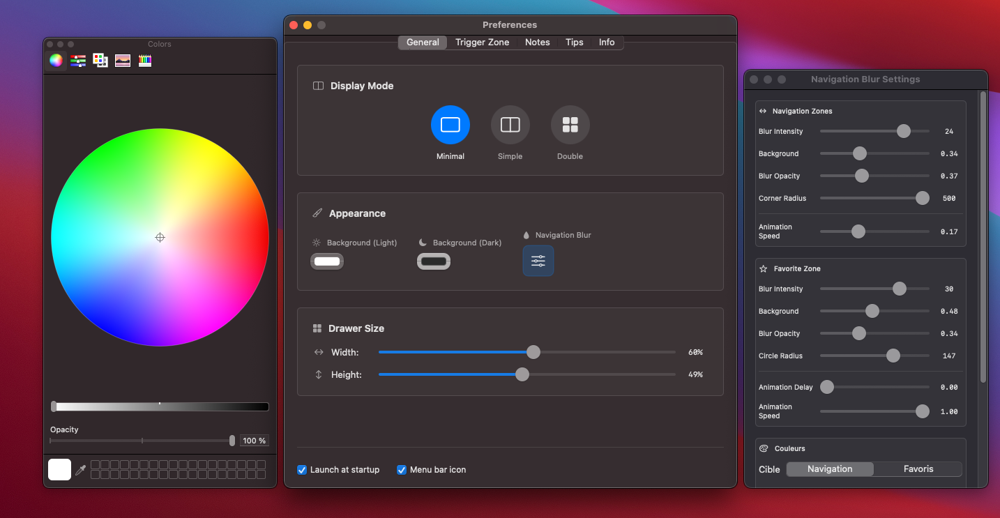
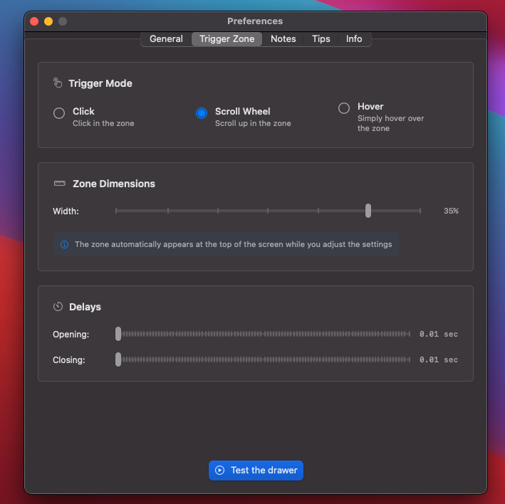
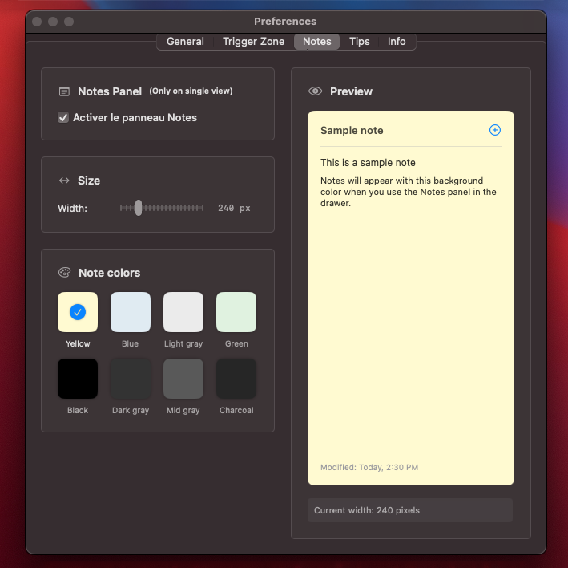
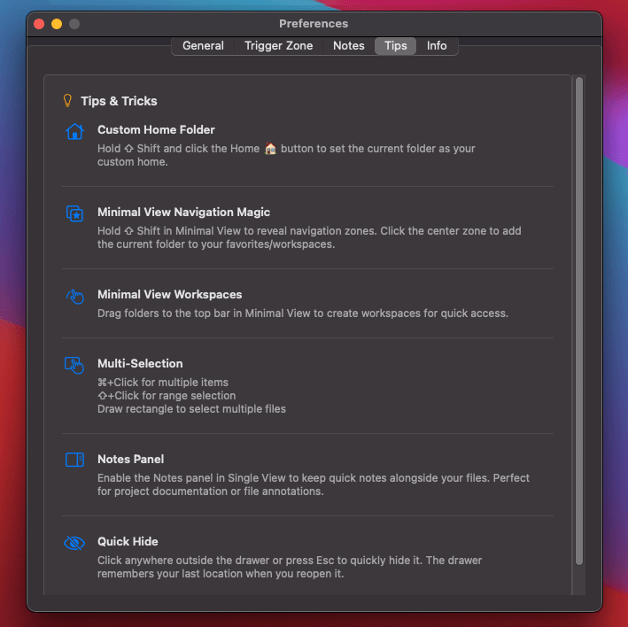

# Drawer

<h3>MonitorControl</h3>

DrawerApp is a navigation drawer that appears at the top of the macOS screen, allowing you to quickly access your files without taking your eyes off the current application.
It makes adding files to your work software easier with minimal, single, or dual-panel modes—particularly useful for workflows that require frequent access to resources. 
It also provides quick access to a dedicated notes panel, independent from the one built into macOS.

  

 
 

 

> [!WARNING]  
> Drawer v2.4.2 is a beta. It was developed primarily for my personal use, and is not necessarily intended to evolve into a fully maintained product. This version was adapted to my macOS Sonoma (Intel) setup.  

## Download

Go to [Releases](https://github.com/Drawer/Drawer/releases) and download the latest `.dmg`.

## Key features of Drawer

- Open your files directly from a drawer at the top of the screen without leaving your current application.

- Choose between a **minimal**, **single** or **double** panel for quick access to your files. Add favourites and organise your access as you wish.

- Quickly access a dedicated notes panel, independent of the Notes application built into macOS.

- Easily add your files to your work software using drag and drop.

- Designed for workflows that require frequent access to resources.

- Adjust the layout and behaviour of the drawer to suit your personal workflow.

- Developed and optimised for a macOS Sonoma configuration running on Intel.

- Initially created for the developer's personal use, with no guarantee of future development.

- Mix of Swift and Appkit for performance.

Translated with DeepL.com (free version)

### Screenshots (Settings)

## How to install and use the app

1. [Download the app](https://github.com/Drawer/Drawer/releases)
2. Copy the MonitorControl app file from the .dmg file to your Applications folder
3. Click on the `MonitorControl` app
4. Add the app to `Launch` 
5. Open `Settings…` for customization options and even more options).

### macOS compatibility

| MonitorControl version | macOS version     |
| ---------------------- | ----------------- |
| v2.4.2                 | Sonomoa 14.7      | 

### ScreenShoot 
- Most modern LCD displays from all major manufacturers supported implemented DDC/CI protocol via USB-C, DisplayPort, HDMI, DVI or VGA to allow for hardware backlight and volume control.
- Apple displays and built-in displays are supported using native protocols.
- LCD and LED Televisions usually do not implement DDC, these are supported using software alternatives to dim the image.
- DisplayLink, Airplay, Sidecar and other virtual screens are supported via shade (overlay) control.

## How to build
